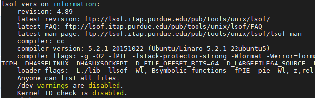

# LSOF

### Description

LSOF (list of open files) plugin capture the open files in the running Linux distribution. This plugin returns the list of files opened based on the file descriptor.

### Prerequisites

*lsof* command needs to be installed before running this plugin.

- To install *lsof* in Centos / RHEL

  ```
  sudo yum install lsof
  ```

- To install *lsof* in Ubuntu

  ```
  sudo apt-get install lsof
  ```

After installing lsof, run the following command to verify the successful installation of lsof.

```
lsof -v
```

 Expected output:



Note: version may vary depending upon the Linux distribution.

###  Configuration Settings

```yaml
-  name: lsof
   enabled: true
   interval: 600
   config:
     completeStats: false
     numProcess: 5
     sortFilter: DIR
```


### Operating Instructions

This plugin can run in two different modes: *summary* and *complete stats*.

- In *summary* mode, it returns only the count of files open of each file descriptor type (like DIR, CHR, REG etc.) and the files open, in total.
- In *complete stats* mode, it returns the entire list of open files in the machine, process wise along with the process id.

##### Configuring parameters

*completeStats*: Since the list of all opened files can be huge in number, plugin is by default configured in summary mode (i.e. *completeStats: false*) . To enable complete stats, set “*completeStats: true*” in plugin configuration. 

*numProcess*: Number of top N processes with maximum number of files opened. For example, if numProcess is set to 5, it returns top 5 process stats with maximum number of files opened. Set numProcess to 0 to get all process details. Default value is 10.

*sortFilter*:  Selection of top N processes only for a particular file descriptor type can be manipulated using sortFilter.  If set, it returns the stats of top N processes with maximum number of files opened of file descriptor type M (sort filter). For example, to get top 10 processes with maximum directories opened, *numProcess* should be set to 10 and *sortFilter* as ‘*DIR’.* Set sort filter to none if no sorting is required. All the options of sortFilter value are available in Dropdown on APM. Following are the options available: *none, CHR, DIR, REG, FIFO, IP, netlink, socket, a_inode*. Default value is *none*.

Note: All the traffic related (IPv4, IPv6) file types are combined as *IPv4/6* and unix, sockets into *socket* for better analysis.

### Metric Documents

Use LSOF dashboard for analysis.

- Summary stats documents are present with document Type “lsofSummary”. Summary stats are displayed under “Summary” pane on LSOF dashboard.
- Complete stats documents are with document Type “lsofStats”. *Open Files* pane shows the number of files opened by each process. This can be filtered based on the file type using the *sort by* dropdown. Likewise, *Process Details*  pane show stats per process.

For help with plugins, please reach out to support@snappyflow.io.
